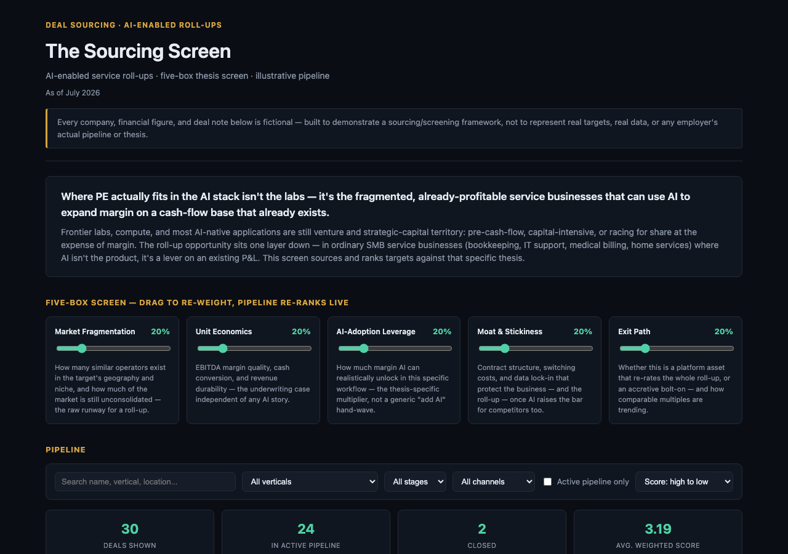

# The Sourcing Screen — AI-Enabled Roll-Up Dashboard

A deal-sourcing and screening dashboard built around a specific, opinionated thesis: PE doesn't play well at the AI labs/compute layer — it plays in the fragmented, already-profitable SMB service businesses (bookkeeping, IT support, medical billing, home services) where AI is a margin lever on an existing cash-flow base, not the product itself.

**All data is fictional.** Every company, financial figure, and deal note is illustrative — built to demonstrate a sourcing/screening framework end-to-end, not to represent real targets or any employer's actual pipeline.



**Open it:** clone the repo and run a local static server (see below) — the app fetches `data.json`, which browsers block over `file://`.

## What's inside

- **The five-box screen** — five weighted criteria (market fragmentation, unit economics, AI-adoption leverage, moat & stickiness, exit path), each with a live slider. Drag any weight and the entire 30-deal pipeline re-ranks in real time — the point is to make the thesis's sensitivity to its own assumptions visible, not just show a static scorecard.
- **A 30-deal illustrative pipeline** across 10 service verticals (IT managed services, bookkeeping, marketing agencies, home services, staffing, legal back-office, medical billing/RCM, logistics, customer support/BPO, property management), spanning every stage from sourced to closed to passed — including deals that fail the screen, not just wins.
- **A deal detail drawer** — click any deal for the full five-box breakdown with a one-line rationale per criterion, plus financials and a thesis note.
- **Filters and live stats** — search, vertical/stage/channel filters, an active-pipeline-only toggle, and a stats bar (deals shown, active pipeline, closed, average weighted score).

## Architecture

Same data/view split as [the AI Stack](https://github.com/bakul007/aistack): `data.json` holds every deal, the framework definition, and the thesis copy; `app.js` renders it and runs the scoring engine; `styles.css` handles presentation. A sourcing pipeline is exactly the kind of content that should be able to update independently of the render logic.

## Running locally

```
git clone https://github.com/bakul007/dealsourcing.git
cd dealsourcing
python3 -m http.server 8000
```

Then open `http://localhost:8000/`.

## Stack

Vanilla HTML/CSS/JS. No framework, no build step, no dependencies.

## License

MIT — see [LICENSE](LICENSE).
